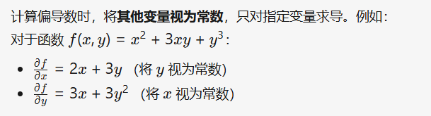

# 概念

利用回归方程（函数）对一个或多个自变量（特征值）和因变量之间的关系进行建模分析的一种方式。


 

# 线性回归分类

一元线性回归：目标值只和一个因变量有关系：

```
y = wx +b
```

 

多元线性回归：目标值只与多个因变量有关系


 

w称作权重，说明对目标值影响越大。

# api 使用

```
from sklearn.linear_model import LinearRegression


# 1 准备数据集
x_train = [[160], [166], [172], [174], [180]] # 身高
y_train = [56.3, 60.6, 65.1, 68.5, 75] # 体重
x_test = [[176], [191]] # 测试


# 创建模型、训练
estimator = LinearRegression()
estimator.fit(x_train, y_train)


# 预测
y_predict = estimator.predict(x_test)
print(f'''
预测值={y_predict}
权重（斜率）={estimator.coef_}
偏置（截距）={estimator.intercept_}
''')
```

 

# 损失函数

损失函数(Loss Function)又被称为代价函数(Cost Function）

 

误差：预测值 - 真实值

 

损失函数：衡量每个样本预测值和真实值差异的函数。

 

如何求损失函数误差最小呢？也就是损失函数的最优解？


y：样本真实值

x：原本预测值

h：权重参数

 

最小二乘：（误差平方和，最小二乘法寻找的是使所有数据点到拟合直线的垂直距离的平方和最小的直线。）


 

均方误差（MSE）：


 

 

平均绝对误差（MAE）


 

# 导数

## 常见的数据表述

标量：存在的数据，只有大小没有方向

向量：一列顺序排列的数据。比如dataframe中的一列数据。默认就是列向量。

矩阵：二维数组。

张量：多维数组。

 

## 导数

导数（Derivative） 是微积分中的核心概念，表示函数在某一点处的瞬时变化率（即函数值相对于自变量的变化快慢）


 

导数函数：函数在所有点 x 的变化率	。

 

导数是函数的局部性质。一个函数在某一点的导数描述了这个函数在这一点附近的变化率。

 

函数在某一点的导数就是该函数所代表的曲线在这一点上的切线斜率

 

## 常见函数导数


 

 

## 导数的四则运算


 

## 导数求极值

导数为0的点，就是函数的极极值点。


 

## 偏导

偏导数是多元函数微积分中的基本概念，用于描述一个多元函数沿着某一个自变量方向的变化率，而将其他自变量视为常数



 

# 向量运算

## 向量加法，减法、乘法


加法：2个向量对应位置数据相加

减法：2个向量对应位置数据相减

乘法：向量所以数乘以对应值

 

## 向量矩阵转置

行列转换


 

## 范数（norm）

范数(norm)是数学中的一种基本概念，具有长度的意义

 

1. L1范数：向量中各个元素绝对值之和
2. L2范数：每个元素平方求和，再开平方根
3. p-范数：向量中每一个元素p幂求和，在开p次根

 


 

# 矩阵

矩阵是数学中的一种基本概念，表达m行n列的数据等

 


 

## 矩阵加法、减法


对应位置元素相加、相减得到新的矩阵。

 

## 矩阵乘法 

对应行列元素相乘，然后再加和再一起

要求：

矩阵A：m行n列

矩阵B： n行d列

结果：m行d列的矩阵

 


 


 

A的行 * B的列，然后相加。

 

矩阵乘法性质：

1. 矩阵乘法不满足交换律： A * B != B * A；特殊条件下满足：A * B = B * A的前提是：A B是同阶方阵。 
2. 矩阵乘法满足结合律。
3. 矩阵和单位阵相成等于矩阵本身。
4. 矩阵的逆， A @ B = 单位矩阵，那么B是A的逆矩阵。

 

 

## 方阵

特殊的矩阵，行数 = 列数。

 

## 单位阵

一种特殊的方阵，主对角线为1，其他为0


 

## 矩阵转置

行列转换


 

矩阵转置的性质：


 

# 正规方程求解

损失函数用来衡量真实值和预测值之间的差异，为优化参数指明了方向。

 

## 一元线性回归


 

## 多元线性回归 


 

# 梯度下降算法

## 梯度下降和梯度

单变量函数中，梯度就是某一点切线的斜率（某一点的导数）是函数增长最快的方向。

 

多变量函数中，梯度是某一个点的偏导数。

 

梯度下降公式：


1. α: 学习率(步长)  不能太大, 也不能太小. 机器学习中：0.001 ~ 0.01
2. 梯度是上升最快的方向, 我们需要是下降最快的方向, 所以需要加负号

 


 

## 梯度下降优化过程

1. 给定初始位置、步长（学习率）

2. 计算该点当前梯度的负方向

3. 向改方向移动步长

4. 重复2-3，直到收敛于：

5. 1. 两次差距小于指定的阈值
   2. 达到指定的迭代次数。

 

**梯度的方向实际就是函数在此点上升最快的方向！  需要朝着下降最快的方向走，负梯度方向， 所以加上负号**

 

学习率(步长)的问题：

1. 步长决定了梯度下降迭代中，每一步沿梯度负方向前进的长度。
2. 学习率太小，下降速度会非常慢。
3. 学习率太大，容易错过最低点，产生下降过程中的震荡、甚至梯度爆炸

 

##  梯度下降法分类

1. 全梯度下降算法 FGD：每次迭代，求梯度使用所有样本。计算量大，训练速度慢。
2. 随机梯度下降算法 SGD：每次迭代时, 随机选择并使用一个样本梯度值 。简单、高效，但是结果不稳定。
3. 小批量梯度下降算法 mini-bantch：每次迭代时, 随机选择并使用小批量的样本梯度值，从m个样本中，选择x个样本进行迭代(1<x<m)。目前使用最多，正是因为它避开了 FG 运算效率低成本大和 SG 收敛效果不稳定的缺点。
4. 随机平均梯度下降算法 SAG：每次迭代时, 随机选择一个样本的梯度值和以往样本的梯度值的均值。训练初期表现不佳，优化速度较慢。这是因为我们常将初始梯度设为0。

 

##  梯度下降法与正规方程对比


 

# 线性回归模型评估 

我们希望衡量预测值和真实值之间的差距

 

## 均方误差(MSE)


## 平均绝对误差 (MAE)


 

## 均方根误差(RMSE)


 

## 总结

1.  一般使用MAE 和 RMSE 这两个指标
2. MAE反应的是“真实”的平均误差，RMSE会将误差大的数据点放大
3. MAE 不能体现出误差大的数据点，RMSE放大大误差的数据点对指标的影响， 但是对异常数据比较敏感

 

# 线性回归API

## 正规方程解法

```
"""
波士顿房价预测, 正规方程解法


正规方程: 一次性求解, 资源开销较大, 适合于小批量干净的数据集, 如果数据没有逆, 也无法计算.
"""


from sklearn.preprocessing import StandardScaler
from sklearn.model_selection import train_test_split
from sklearn.linear_model import LinearRegression
from sklearn.linear_model import SGDRegressor
from sklearn.metrics import mean_squared_error, mean_absolute_error
import pandas as pd
import numpy as np


# 1. 获取数据
data_url = "http://lib.stat.cmu.edu/datasets/boston"
raw_df = pd.read_csv(data_url, sep="\\s+", skiprows=22, header=None)
data = np.hstack([raw_df.values[::2, :], raw_df.values[1::2, :2]])
target = raw_df.values[1::2, 2]
print(f'特征: {len(data)}, {data[:5]}')
print(f'目标: {len(target)}, {target[:5]}')


# 2. 拆分训练集，测试集
x_train, x_test, y_train, y_test = train_test_split(data, target, test_size=0.2, random_state=22)


# 3. 特征工程。数据预处理（标准化，归一化）
transfer = StandardScaler()
# 对训练集、测试集都进行标准化处理
x_train = transfer.fit_transform(x_train)
x_test = transfer.transform(x_test)


# 4. 模型训练
# fit_intercept,是否计算截距。默认为true
estimator = LinearRegression(fit_intercept=True)
estimator.fit(x_train, y_train)


# 5. 模型预测
y_predict = estimator.predict(x_test)
print(f"""
预测值: {y_predict},
权重：{estimator.coef_}
偏置：{estimator.intercept_}
""")


print('-' * 22)


# 6. 模型评估
print(f"""
平方绝对误差：{mean_absolute_error(y_test, y_predict)}
均方误差：{mean_squared_error(y_test, y_predict)}
""")
```

 

## 随机梯度下降

```
"""
波士顿房价预测, 梯度下降解法


梯度下降: 迭代求解, 资源开销相对较小, 适用于大批量的数据集, 实际开发 更推荐
"""


from sklearn.preprocessing import StandardScaler
from sklearn.model_selection import train_test_split
from sklearn.linear_model import LinearRegression
from sklearn.linear_model import SGDRegressor
from sklearn.metrics import mean_squared_error, mean_absolute_error
import pandas as pd
import numpy as np


# 1. 获取数据
data_url = "http://lib.stat.cmu.edu/datasets/boston"
raw_df = pd.read_csv(data_url, sep="\\s+", skiprows=22, header=None)
data = np.hstack([raw_df.values[::2, :], raw_df.values[1::2, :2]])
target = raw_df.values[1::2, 2]
print(f'特征: {len(data)}, {data[:5]}')
print(f'目标: {len(target)}, {target[:5]}')


# 2. 拆分训练集，测试集
x_train, x_test, y_train, y_test = train_test_split(data, target, test_size=0.2, random_state=22)


# 3. 特征工程。数据预处理（标准化，归一化）
transfer = StandardScaler()
# 对训练集、测试集都进行标准化处理
x_train = transfer.fit_transform(x_train)
x_test = transfer.transform(x_test)


# 4. 模型训练
# SGDRegressor 随机梯度下降。这里使用固定的学习率
estimator = SGDRegressor(
    fit_intercept=True,
    learning_rate="constant",
    eta0=0.0001
)
estimator.fit(x_train, y_train)


# 5. 模型预测
y_predict = estimator.predict(x_test)
print(f"""
预测值: {y_predict},
权重：{estimator.coef_}
偏置：{estimator.intercept_}
""")


print('-' * 22)


# 6. 模型评估
print(f"""
平方绝对误差：{mean_absolute_error(y_test, y_predict)}
均方误差：{mean_squared_error(y_test, y_predict)}
""")
```

 

# 正则化

## 模型的泛化

指的是一个机器学习模型在从未见过的新数据上表现良好的能力。

简单来说，它衡量的是模型学到的规律是否具有普适性，而不是仅仅记住了训练时用的例子。一个泛化能力强的模型能够将从训练数据中学到的“知识”或“模式”，有效地应用并做出准确的预测。

 

模型的泛化能力不足，通常是过拟合或者欠拟合

## 欠拟合与过拟合

欠拟合：模型在训练集、测试集表现都不好，误差较大。出现原因：学习到的特征过少。

解决办法：

1. 添加其他特征。
2. 添加多项式特征，例如将线性模型通过添加二次项或三次项使模型泛化能力更强

 

 

过拟合：模型在训练集表现好，误差小；在测试集表现不好，误差较大。出现原因：原始特征过多，模型过于复杂是因为模型尝试去兼顾各个测试数据点。

解决办法：

1. 重写清洗数据：对于异常数据、数据不纯的地方再处理。
2. 增加模型的训练数据量。
3. 正则化。解决模型过拟合的方法，在机器学习、深度学习中大量使用
4. 减少特征维度。

 

## 正则化概念

在模型训练时，数据中的某些特征影响模型复杂度，或者某个特征异常值比较多。要尽量减少这个特征的影响（甚至删除某个特征的影响），这就是正则化。

 

## L1正则化

在损失函数中添加L1正则化项：


1. α 叫做惩罚系数，该值越大则权重调整的幅度就越大，即：表示对特征权重惩罚力度就越大
2. L1 正则化会使得权重趋向于 0，甚至等于 0，使得某些特征失效，达到特征筛选的目的

 

LASSO回归: from sklearn.linear_model import Lasso

 

## L2正则化

在损失函数中添加L2正则化项：

 


1. α 叫做惩罚系数，该值越大则权重调整的幅度就越大，即：表示对特征权重惩罚力度就越大
2. L2 正则化会使得权重趋向于 0，一般不等于 0

 

Ridge回归: from sklearn.linear_model import Ridge

 