# 决策树

决策树是一种有监督的学习算法。

和程序中的if else代码一样，根据逻辑条件进行判断，每个分支就是一种决策。

他是一种树形结构，数中每个内部节点表示一个特征上的判断，每个分支代表一个判断结果的输出，每个叶子节点代表一种分类结果（标签）。如下图：

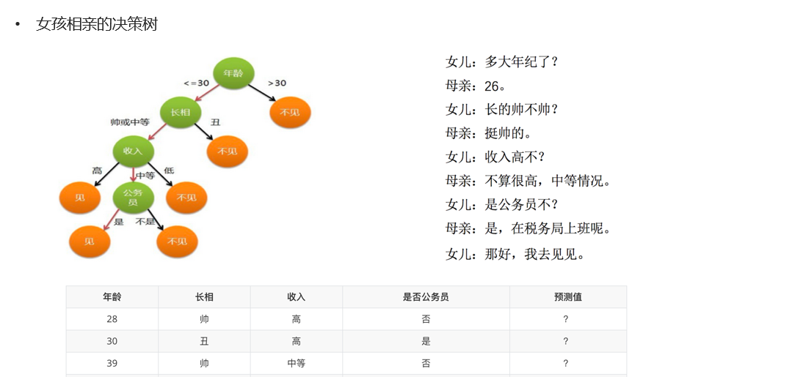


建立过程：

1. 特征选择：选取有较强分类能的特征

2. 决策树生成：根据选择的特征生成决策树

3. 决策树也易过拟合，采用剪枝的方法缓解过拟合。


# ID3决策树

## 信息熵

ID3 树是基于信息增益构建的决策树。

熵的定义：

1. 熵在信息论中代表随机变量不确定度的度量
2. 熵越大，数据的不确定性度越高
3. 熵越小，数据的不确定性越低

计算公式：


1. H(x)就是信息的熵值
2. P(xi) 表示数据中类别出现的概率。


举个例指：计算数据 β（AAAABBCD） 信息熵：其中A 出现的概率为1/2，B 出现的概率为1/4，C、D 出现的概率为1/8。

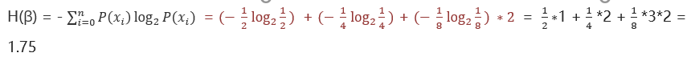


##  信息增益

信息增益 = 熵 - 条件熵

条件熵 ：

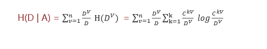

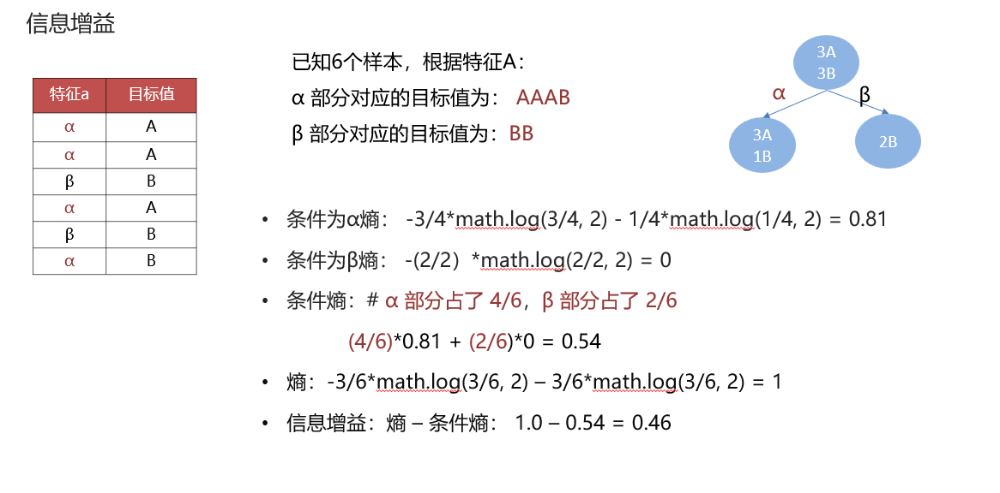

## 构建流程

1. 计算每个特征的信息增益
2. 使用信息增益最大的特征将数据集 S 拆分为子集
3. 使用该特征（信息增益最大的特征）作为决策树的一个节点
4. 使用剩余特征对子集重复上述（1，2，3）过程

# C4.5决策树

ID3树的不足：偏向于选择种类多的特征作为分裂依据，容易导致过拟合。

##  信息增益率

信息增益率 = 信息增益 / 特征熵。选择信息增益率大的特征作为分裂依据

信息增益率的本质：

1. 特征的信息增益 / 特征的内在信息
2. 相当于对信息增益进行修正，增加一个惩罚系数
3. 特征值个数较多时，惩罚系数较小；特征取值个数较少时，惩罚系数较大。
4. 惩罚系数：数据集D以特征a作为随机变量的熵的倒数。


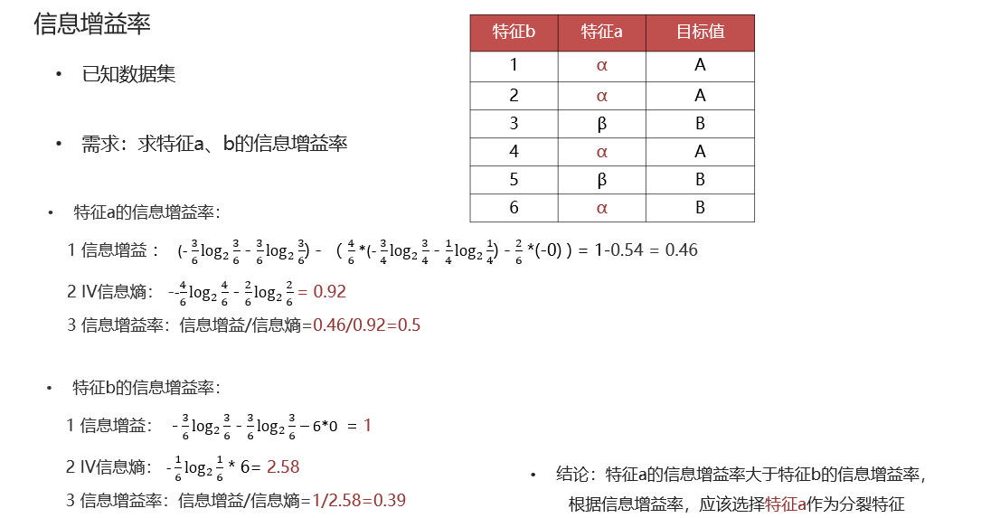

# CART决策树

## 介绍

Cart模型是一种决策树模型，它即可以用于分类，也可以用于回归，是一种严格二叉树

分类模型：使用gini指数最小化策略

回归模型：使用平方误差最小化策略。


## 基尼指数

基尼值Gini（D）：从数据集D中随机抽取两个样本，其类别标记不一致的概率。故，Gini（D）值越小，数据集D的纯度越高。

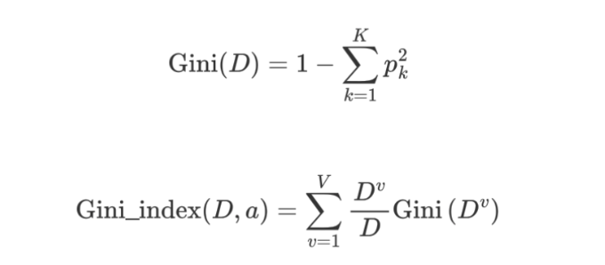

基尼指数值越小，则说明优先选择该特征。

计算过程：

分类计算：

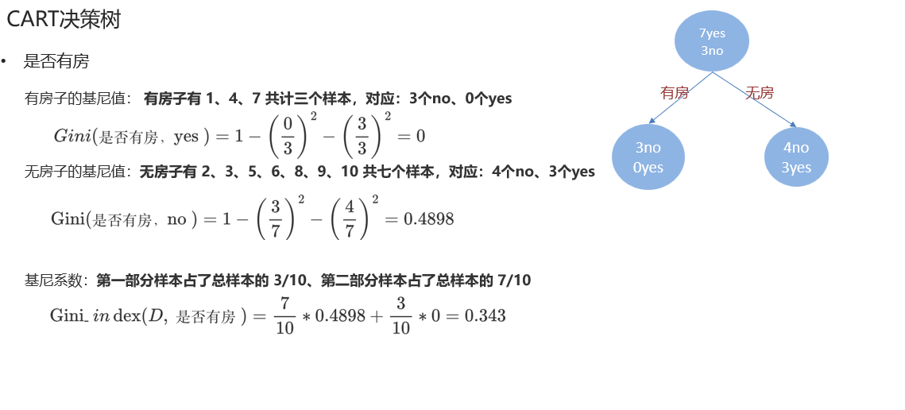

连续值计算：

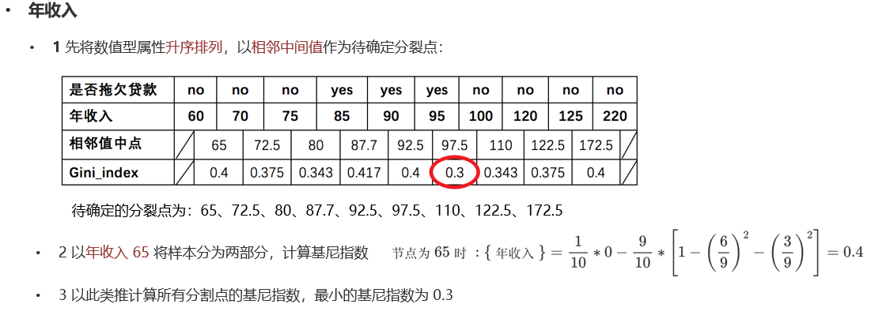


## 分类代码

```
import pandas as pd  # 数据处理
from sklearn.model_selection import train_test_split  # 训练集和测试集分割
from sklearn.preprocessing import StandardScaler  # 标准化
from sklearn.tree import DecisionTreeClassifier  # 决策树分类器
from sklearn.metrics import classification_report  # 分类报告
import matplotlib.pyplot as plt  # 绘图
from sklearn.tree import plot_tree  # 绘制决策树

# 1. 读取数据
df = pd.read_csv("./data/train.csv")

# 2. 数据预处理
x = df[["Pclass", "Sex", "Age"]]  # 船舱等级, 性别, 年龄.
y = df["Survived"]  # 是否: Died, Survivor.
# 使用Age平均值填充空值
x['Age'] = x['Age'].fillna(x['Age'].mean())
# 对sex 做热编码处理
x = pd.get_dummies(x)
x = x.drop(columns=["Sex_female"])
x = x.rename(columns={"Sex_male": "sex"})
print(x.head(5))

# 3. 拆分训练集和测试集.
x_train, x_test, y_train, y_test = train_test_split(x, y, test_size=0.2, random_state=22)

# 4. 模型训练
# DecisionTreeClassifier 默认使用gini值，也就是cart数
estimator = DecisionTreeClassifier()
estimator.fit(x_train, y_train)

# 5. 预测
y_predict = estimator.predict(x_test)
print("预测结果为:\n", y_predict)


# 6. 模型评估
print(f"""
准确率: {estimator.score(x_test, y_test)}
分类评估报告: {classification_report(y_test, y_predict, target_names=["Died", "Survivor"])}
""")

# 7. 绘图
plt.figure(figsize=(50, 30))
# 7.2 绘制决策树.
# 参1: estimator: 决策树分类器,  参2: filled: 填充颜色,  参3: max_depth: 层数.
plot_tree(estimator, filled=True, max_depth=10)
# 保存图片.
plt.savefig("./data/titanic_tree.png")
# 7.3 具体的绘制.
plt.show()
```

#  CART 回归决策树

## 介绍

和分类树的区别：

1. 分类预测的是一个离散值，回归预测输出一个连续值
2. CART 分类树使用基尼指数作为划分、构建树的依据，CART 回归树使用平方损失。
3. 分类树使用叶子节点里出现更多次数的类别作为预测类别，回归树则采用叶子节点里均值作为预测输出


回归树损失函数：


构建过程：

1. 选择第一个特征，将特征进行排序，取相邻点计算均值作为待划分点
2. 根据划分点，将数据分成两部分：R1、R2
3. R1 和 R2 两部分的平方损失相加作为该切分点平方损失
4. 取最小的平方损失的划分点，作为当前特征的划分点
5. 以此计算其他特征的最优划分点、以及该划分点对应的损失值
6. 在所有的特征的划分点中，选择出最小平方损失的划分点，作为当前树的分裂点

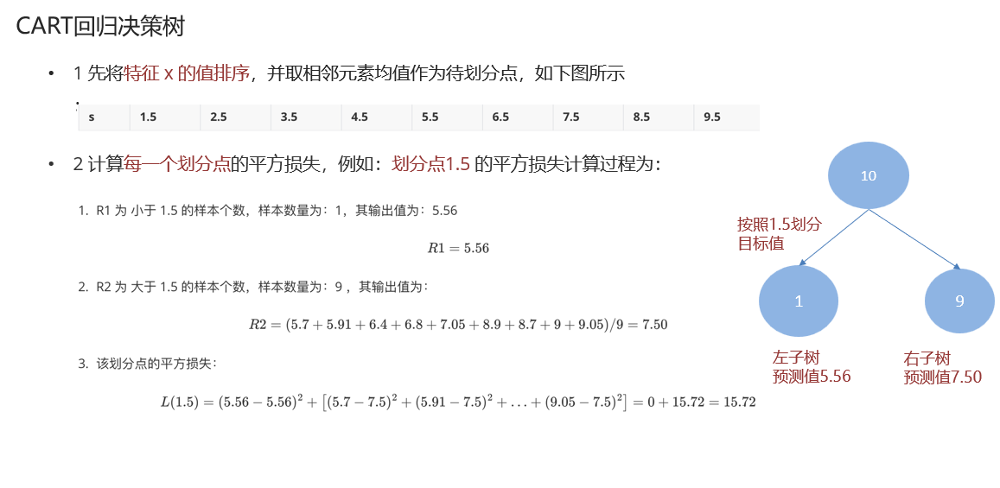

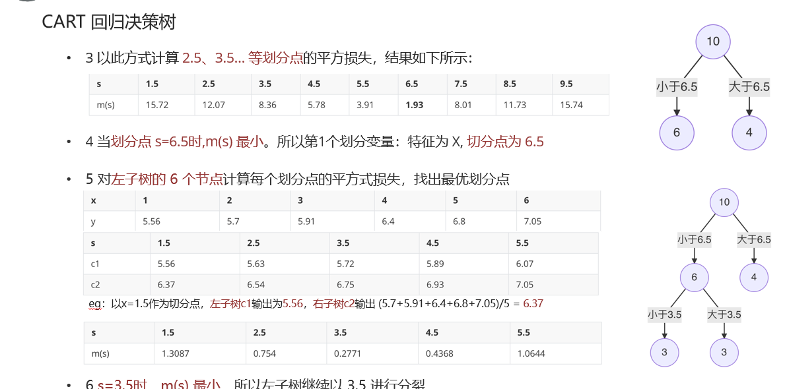

# 决策树剪枝

## 介绍

决策树剪枝是一种防止决策树过拟合的一种正则化方法；提高其泛化能力。

剪枝：把子树的节点全部删掉，使用用叶子节点来替换


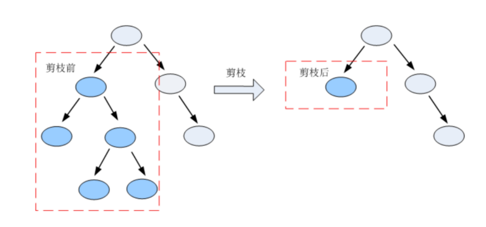


## 常见减枝方法

预剪枝：指在决策树生成过程中，对每个节点在划分前先进行估计，若当前节点的划分不能带来决策树泛化性能提升，则停止划分并将当前节点标记为叶节点;

后剪枝：是先从训练集生成一棵完整的决策树，然后自底向上地对非叶节点进行考察，若将该节点对应的子树替换为叶节点能带来决策树泛化性能提升，则将该子树替换为叶节点。


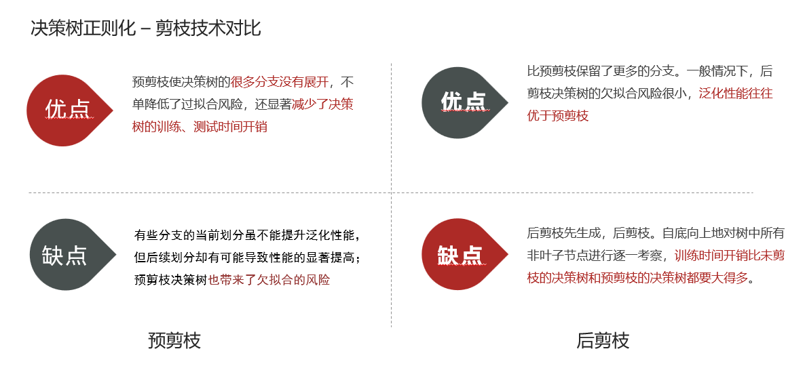