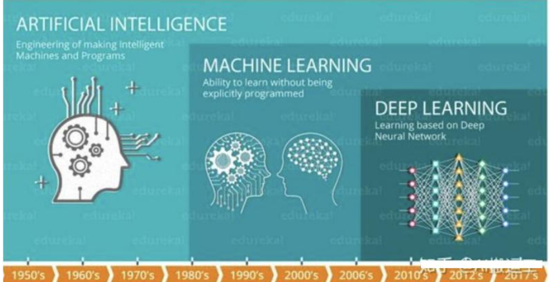
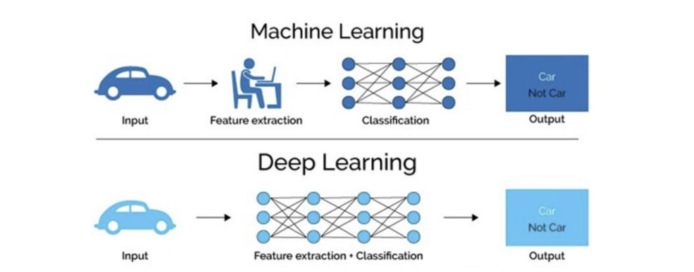

# 概念

机器学习是实现人工智能的一种途径，是机器学习的一个分支。

一种以人工神经网络为架构，对数据进行特征学习的算法。深度学习中的深度是指在网络中使用多层，每层都通过非线性变换处理数据，并且逐渐提取更复杂、抽象的特征。

## 核心思想

1. 通过模仿人脑的神经网络来处理和分析复杂数据。
2. 从大量数据自动提取复杂特征。
3. 擅长处理高纬数据，比如图像、语音、文本。

## 特点

1. 多层非线性变换。深度学习模型由多个层次组成，每一层都应用非线性激活函数对输入数据进行变换。较低层级通常捕捉简单的特征（比如边缘、颜色等）；而更高的层级可以识别复杂的特征（比如面部识别）
2. 自动特征提取。和传统机器学习算法不同，深度学习能够自动从原始数据学习到有用的特征，而不需要人工特征工程。
3. 大数据和计算能力。深度学习模型通常需要大量的标注数据和强大的计算资源（GPU）来进行训练。大数据和高性能计算使得深度学习在图像识别、自然语言处理等领域取得了显著突破。
4. 可解释性差。深度学习内部的运作机制相对不透明，被称为“黑箱”，这意味着理解模型为什么做出特定决策可能会比较困难。这对某些应用场景来说是一个挑战。

## 常见深度学习模型

### 卷积神经网络 （CNN）

1. 主要用于处理图像任务，比如图像分类、目标检测、图像分隔等
2. 特点是使用卷积层自动提取图像局部特征，通过池化减少参数数量，提升计算效率。

### 循环神经网络（RNN）

1. 使用处理序列数据，比如自然语言处理（NLP）、语音识别。
2. RNN具有记忆功能，可以处理输入数据的时间依赖性，但标准RNN难以捕捉长期依赖关系。

### 自编码器 (Autoencoders)

1. 一种无监督学习模型，通常用于降维、特征学习或者异常检测。
2. 自编码器由编码器和解码器两部分组成，前者将输入压缩成一个较低维度的表示，后者尝试从这个低维表示重建原始输入

### 生成对抗网络 (GAN

1. 包含两个子网络：生成器和判别器。生成器负责创建看起来真实的假样本，而判别器则试图区分真假样本。
2. GAN广泛应用于图像生成、视频合成等领域。

### Transformer

1. 主要用于自然语言处理（NLP）任务，尤其是机器翻译、文本生成等。
2. Transformer摒弃了传统的递归结构，采用自注意力机制（self-attention），使得它能够并行处理整个句子的信息，在机器翻译、文本摘要等任务中表现出色。

# 应用场景

## 计算机视觉（CV）

1. 图像分类，人脸识别、物体检测等
2. 目标检测，自动驾驶中的行人检测、监控视频中的入侵检测。
3. 面部识别
4. 图像生成，基于输入生成新的图像，如风格转换、图像超分辨率等。

## 自然语言处理（NLP）

1. 机器翻译，使用深度学习模型将一种语言的文本自动翻译成另一种语言。
2. 情感分析，分析文本中的情感倾向，如正面、负面或中性
3. 文本生成，生成符合语法和语义的自然语言文本
4. 语音识别**：将语音转化为文字
5. 聊天机器人（Chatbot）**：通过深度学习理解用户输入并生成合理的回应

## 推荐系统

1. 电影、音乐推荐**：根据用户历史的评分和行为，推荐相关的电影、音乐或电视剧
2. 电商推荐**：根据用户的购买历史和浏览习惯推荐商品
3. 社交媒体推荐**：分析用户的社交行为，推荐相关内容或朋友

# 深度学习发展历史

