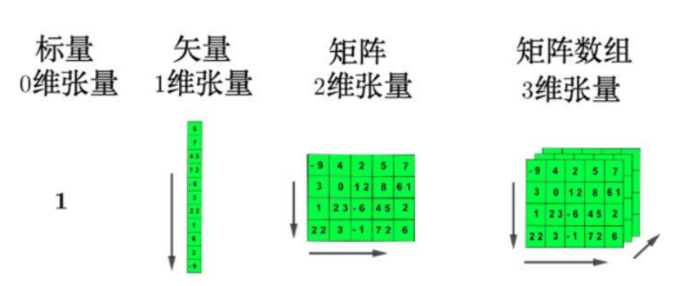

# PyTorch框架简介

## 介绍

- PyTorch一个基于Python语言的深度学习框架，它将数据封装成张量（Tensor）来进行处理。
- PyTorch提供了灵活且高效的工具，用于构建、训练和部署机器学习和深度学习模型。
- PyTorch广泛应用于学术研究和工业界，特别是在计算机视觉、自然语言处理、强化学习等领域。

## 特点

+ 基于动态计算图
+ API设计更加贴近Python，易于学习和使用
+ 类似于NumPy的张量计算
+ 自动微分系统，自动微分使得梯度计算过程变得简洁和高效，并且支持复杂的模型和动态计算图
+ 深度学习库，提供了一个名为**torch.nn**的子模块，用于构建神经网络。它包括了大量的预构建的层（如全连接层、卷积层、循环神经网络层等），损失函数（如交叉熵、均方误差等），以及优化算法（如SGD、Adam等）。
+ GPU加速（CUDA支持）
+ 跨平台支持

# 张量

## 基本概念

+ 张量：存储统一类型元素的容器（多维矩阵），并且元素必须是数值类型。和NumPy数组类似，但是PyTorch张量具有GPU加速能力。
+ PyTorch中，张量以"类"的形式封装起来，对张量的一些运算、处理的方法（数值计算、矩阵操作、自动求导）被封装在类中。
+ 张量是PyTorch的核心数据抽象；支持各种张量类型。通常地，一维张量称为向量/矢量（vector），二维张量称为矩阵（matrix）。



## 创建方式

1. 创建张量的方式
   • torch.tensor() 根据指定数据创建张量
   • torch.Tensor() 根据形状创建张量, 其也可用来创建指定数据的张量
   • torch.IntTensor()、torch.FloatTensor()、torch.DoubleTensor() 创建指定类型的张量
2. 创建线性和随机张量
   • torch.arrange() 和 torch.linspace() 创建线性张量
   • torch.random.initial_seed() 和 torch.random.manual_seed() 随机种子设置
   • torch.randn() 创建随机张量
3. 创建0、1、指定值张量
   • torch.ones() 和 torch.ones_like() 创建全1张量
   • torch.zeros() 和 torch.zeros_like() 创建全0张量
   • torch.full() 和 torch.full_like() 创建全为指定值张量
4. 张量元素类型转换
   • data.type(dtype=)
   • data.half/double/float/short/int/long()

### 基本张量创建

```
import torch
import numpy as np


# 根据指定数据创建张量
def dm01():
    # 创建0维张量。
    t1 = torch.tensor(10)
    print(f"t1: {t1}, type: {type(t1)}")

    # 创建1维张量
    t2 = torch.tensor([1, 2, 3])
    print(f"t2: {t2}, type: {type(t2)}")

    # 创建二维张量
    t3 = torch.tensor([[1, 2, 3], [4, 5, 6]])
    print(f"t3: {t3}, type: {type(t3)}")

    # numpy数组 -> 张量
    data = np.random.randint(0, 10, (2, 3))
    t4 = torch.IntTensor(data)
    print(f"t4: {t4}, type: {type(t4)}")

    # 如果类型不匹配，会自动转换
    t5 = torch.FloatTensor(data)
    # 默认: float32，不显示类型
    print(f"t5: {t5}, type: {type(t5)}")

    # 使用torch.Tensor创建张量
    t6 = torch.Tensor([[11, 12, 13], [21, 22, 23]])
    print(f"t6: {t6}, type: {type(t6)}")

    # 创建指定形状的张量。数据默认为0
    t7 = torch.Tensor(2, 3)
    print(f"t7: {t7}, type: {type(t7)}")

    # 创建指定类型的张量
    t8 = torch.DoubleTensor([[11, 12, 13], [21, 22, 23]])
    print(f"t8: {t8}, type: {type(t8)}")


if __name__ == '__main__':
    dm01()
```

### 创建线性和随机张量

```
import torch

# 1. 创建指定访问的线性张量,
# 参1: 起始值, 参2: 结束值（不包含）, 参3: 步长.
t1 = torch.arange(0, 10, 2) # [0, 2, 4, 6, 8]
print(f"t1 {t1}, type {type(t1)}")

# 2. 创建等差数量线性张量
# 参1: 起始值, 参2: 结束值, 参3: 元素的个数
t2 = torch.linspace(1, 10, 5)
print(f"t2 {t2}, type {type(t2)}")


# 3. 创建随机张量
# 设置随机数种子，全局的。
# 随机数种子设置之后，每次生成的随机数都是相同的。
torch.manual_seed(22)

# 3.1 均匀分布的(0, 1) 随机张量
t3 = torch.rand(size=(2, 3))
print(f"t3 {t3}, type {type(t3)}")

# 3.2 符合正太分布的随机张量
t4 = torch.randn(size=(2, 3))
print(f"t4 {t4}, type {type(t4)}")

# 3.3 创建随机整数张量
# 参1: 最小值, 参2: 最大值(不包含), 参3: 形状
t5 = torch.randint(low=0, high=10, size=(2, 3))
print(f"t5 {t5}, type {type(t5)}")
```

### 创建指定值张量

```
import torch

# 1. 创建全1的张量
# 创建2行3列的全1张量
t1 = torch.ones(2, 3)
print(f"t1: {t1}, type: {type(t1)}")

# 2. t3 -> 基于t2的形状, 创建全1张量.
t2 = torch.tensor([[1, 2], [3, 4], [5, 6]])
t3 = torch.ones_like(t2)
print(f"t2: {t2}, type: {type(t2)}")

# 3. 创建全0张量
t4 = torch.zeros(2, 3)
print(f"t4: {t4}, type: {type(t4)}")
# 基于t2的形状, 创建全0张量.
t5 = torch.zeros_like(t2)
print(f"t5: {t5}, type: {type(t5)}")


# 4. 创建指定值的张量
# 创建2行3列，所有值为5张量
t6 = torch.full((2, 3), 5)
print(f"t6: {t6}, type: {type(t6)}")
# # 基于t2的形状, 创建全255张量.
t7 = torch.full_like(t2, 255)
print(f"t7: {t7}, type: {type(t7)}")
```

### 创建指定类型的张量

```
import torch

# 1. 创建指定类型的张量
t1 = torch.tensor([1, 2, 3], dtype=torch.float32)
print(f"t1: {t1}, 类型： {t1.dtype}")

# 2. 类型转换
t2 = t1.type(torch.double)
print(f"t2: {t2}, 类型： {t2.dtype}")

# 3. 直接转换类型
print(t2.half())        # float16
print(t2.float())       # float32, 默认
print(t2.double())      # float64
print(t2.short())       # int16
print(t2.int())         # int32
print(t2.long())        # int64, 默认
```

## 张量和NumPy

1. 张量转换为 numpy 数组
    • data_tensor.numpy() 共享内存；
    • data_tensor.numpy().copy()，复制一份
2. numpy 转换为张量
    • torch.from_numpy(data_numpy)
    • torch.tensor(data_numpy)
3. 标量张量和数字转换
    • tensor.item()

```
import numpy as np
import torch

# 张量转换为NumPy
def dm01():
    t1 = torch.tensor([1, 2, 3])

    # 1. 张量 -> numpy
    n1 = t1.numpy() # 共享内存
    n2 = t1.numpy().copy() # 复制一份，不公正内存

    # t1, n1 数据都改变，n2 数据未改变
    n1[0] = 11
    print(f"""
    t1: {t1}
    n1: {n1}
    n2: {n2}
    """)

# numpy -> 张量
def dm02():
    n1 = np.array([1, 2, 3])

    # 1. numpy -> 张量
    t1 = torch.from_numpy(n1) # 共享内存
    t2 = torch.tensor(n1)  # 不共享内存

    # t1, n1 数据都改变，t2 数据未改变
    n1[0] = 100
    print(f"""
    t1: {t1}
    n1: {n1}
    t2: {t2}
    """)


def dm03():
    t1 = torch.tensor(11)
    # 从张量提前内容
    a = t1.item()
    print(f'value: {a}, type: {type(a)}')


if __name__ == '__main__':
    dm03()
```


## 张量数值运算

### 基本运算

1. add、sub、mul、div、neg
2. add_、sub_、mul_、div_、neg_（其中带下划线的版本会修改原数据）
3. 可以用 “+, -, *, / ”符号来替代 上述的 加减乘除函数.
4. 张量和数值运算, 该数值会和张量中的每个值依次进行对应的运算.

```
import torch

# 张量的基本运算
t1 = torch.tensor([1, 2, 3])

# 1. 张量加法，张量所有元素加10
t2 = t1.add(10) # 不会修改元数据
print(f"t2: {t2}")

# 2. 张量减法，张量所有元素减10
t3 = t1.sub(10)
print(f"t3: {t3}")

# 3. 张量乘法，张量所有元素乘10
t4 = t1.mul(10)
print(f"t4: {t4}")

# 4. 张量除法，张量所有元素除10
t5 = t1.div(10) # 会自动转换为浮点数
print(f"t5: {t5}")

# 5. 张量取负 [-1, -2, -3]
t6 = t1.neg()
print(f"t6: {t6}")
```

### 点乘运算

点乘指（Hadamard）的是相同形状的张量对应位置的元素相乘，使用mul 和运算符 * 实现。

```
import torch

# 张量的基本运算
t1 = torch.tensor([1, 2, 3])
t2 = torch.tensor([10, 20, 30])

# [10, 40, 90]。 对于位置相乘
t3 = t1.mul(t2)
print(f"t3: {t3}")
```

### 矩阵乘法

要求: 两个张量, 第一个张量的列数, 等于 第二个张量 的行数(A列 = B行)
结果: A行B列

运算符 @ 用于进行两个矩阵的乘积运算


```
import torch

# 条件: A列=B行, 结果: A行B列
# 1. 定义张量, 2行3列.
t1 = torch.tensor([[1, 2, 3], [4, 5, 6]])
print(f't1: {t1}')

# 2. 定义张量, 3行2列.
t2 = torch.tensor([[1, 2], [3, 4], [5, 6]])
print(f't2: {t2}')

# 3. 演示 张量 矩阵乘法操作.
t3 = t1 @ t2
# t3 = t1.matmul(t2)  # 效果同上, matrix multiply(矩阵乘法）
print(f't3: {t3}')
```

## 张量运算函数

sum,mean,sqrt,pow,exp,log,max,min等

```
import torch

t1 = torch.tensor([[1, 2, 3], [4, 5, 6]], dtype=torch.float)
print(f't1: {t1}')

# 1. 求和
# 张量求和: 21.0
# 按照列求和: tensor([5., 7., 9.])
# 按照行求和：tensor([ 6., 15.])
print(f"""
张量求和: {t1.sum()}
按照列求和: {t1.sum(dim=0)}
按照行求和：{t1.sum(dim=1)}
""")

# 2. 求最大、最小值。max、min
print(f"""
张量求最大值: {t1.max()}
按照列求最大值: {t1.max(dim=0)}
按照行求最大值：{t1.max(dim=1)}
""")

# 3. mean()， 计算平均值
print(f"""
张量求平均值: {t1.mean()}
按照列求平均值: {t1.mean(dim=0)}
按照行求平均值：{t1.mean(dim=1)}
""")

# 4. 计算n次幂，没有dim参数。所有元素计算的n次幂
print(t1.pow(2))

# sqrt() 平方根，也没有dim参数，所有元素计算平方根
print(t1.sqrt())
```

## 张量索引操作

```
import torch

torch.manual_seed(22)

# 1. 创建5行5列的随机张量
t1 = torch.randint(1, 10, (5, 5))
print(f"t1: {t1}")

# 2. 使用切片获取张量的一部分
print(f"""
获取第二行：{t1[1]}
获取第二行：{t1[1, :]}
-----
获取第三列：{t1[:, 2]}
""")

# 3. 获取到指定行列。 列表索引, 前边的表示行, 后边的表示列。1就是表示1行, 2就是表示第二列。
print(f"""
返回(1, 2), (3, 4)两个位置的元素: {t1[[1, 2], [3, 4]]}
获取第0, 1行的 1, 2列共4个元素：{t1[[[0], [1]], [1, 2]]}
""")

# 4. 范围索引
print(f"""
获取前3行，前2列的元素：{t1[:3, :2]}
第2行到最后一行, 前2列的数据: {t1[1:, :2]}
""")

# 5. 所有奇数行, 偶数列。 ::2表示步长为2
print(t1[1::2, ::2])

# 6. 布尔索引
print(t1[torch.tensor([True, False, False, True, True]), :])

# 7. 值筛选
# t1[:, 2] 获取第3列的数据 [2, 2, 3, 2, 6]
# 对第3列的值进行逐元素比较，返回布尔数组：[false, false, false, false, true]
# 用布尔数组作为索引，筛选出值为 True的行，这里只有第5行数据：[[4, 5, 6, 2, 2]]
print(f"""
第3列 大于5的行数据: {t1[t1[:, 2] > 5]}
第2行大于5的 列数据： {t1[:, t1[1, :] > 5]}
在第2行的基础上, 找该行所有列中大于5的元素：{t1[1, t1[1, :] > 5]}
""")


# 7. 多维索引
t2 = torch.randint(1, 10, (2, 3, 4))
# [ -- 0轴
#   [-- 1轴
#       [8 , 1, 7, 5], --2轴
#       [1, 4, 5, 4],
#       [7, 5, 5, 4]
#   ],
#   [
#       [9, 6, 4, 7],
#       [1, 1, 5, 4],
#       [8, 7, 5, 2]
#   ]
# ]
print(f"t2: {t2}")

# 8 获取对于轴的数据。
print(f"""
获取第0轴的第一个数据：{t2[0, :, :]},
获取第1轴的第一个数据：{t2[:, 0, :]},
获取第2轴的第一个数据：{t2[:, :, 0]},
""")
```

## 张量形状操作

注意：

1. transpose，permute操作后，和原来的张量共享内存；这也是导致不连续的原因。
2. contiguous，会除非内存拷贝，变成连续的。
3. reshape，如果是连续的，共享内存；如果不连续，会触发拷贝（隐式调用contiguous()）

```
import torch

torch.manual_seed(22)


def reshape():
    # 1. 定义张量
    t1 = torch.randint(1, 10, size=(2, 3))
    print(f"t1: {t1}")

    # 2. 改变张量的形状。改变后的形状必须和原张量的元素数量一致
    print(f"""
    (3,2): {t1.reshape(3, 2)}
    (1, 6): {t1.reshape(1, 6)}
    (1, 6): {t1.reshape(2, 3, 1)}
    """)


def squeeze():
    t1 = torch.randint(1, 10, size=(2, 3))
    print(f't1: {t1}, shape: {t1.shape}')

    # 1. 在0维度上添加1个维度
    t2 = t1.unsqueeze(0)
    print(f't2: {t2}, shape: {t2.shape}')

    # 2. 在1维上, 添加一个维度.
    # 添加的维度不能操过张量的维度
    # 添加维度的意思, [1, 2, 3],
    # 添加0维： [[1, 2, 3]]
    # 添加1维： [[1], [2], [3]]
    t3 = t1.unsqueeze(1)
    print(f't3: {t3}, shape: {t3.shape}')

    # 3. 在2维上, 添加一个维度.
    t4 = t1.unsqueeze(2)
    print(f't4: {t4}, shape: {t4.shape}')

    t5 = torch.randint(1, 10, size=(2, 1, 3, 1, 1))
    print(f't5: {t5}, shape: {t5.shape}')

    # 删除所有为1的维度，元素数量不变。
    t6 = t5.squeeze()
    print(f't6: {t6}, shape: {t6.shape}')


def transpose():
    t1 = torch.randint(1, 10, size=(2, 3, 4))
    print(f't1: {t1}, shape: {t1.shape}')

    # 2. 改变维度从 (2, 3, 4) -> (4, 3, 2)
    # transpose 交换 0和1维。 只能交换2个维度。
    t2 = t1.transpose(0, -1)
    print(f't2: {t2}, shape: {t2.shape}')

    # 3. 改变维度从 (2, 3, 4) -> (4, 2, 3)
    # permute(2, 0, 1), 2维变成0维，0维变成1维，1维变成2维 -> (4, 2, 3)
    t3 = t1.permute(2, 0, 1)
    print(f't3: {t3}, shape: {t3.shape}')


def view():
    t1 = torch.randint(1, 10, size=(2, 3))
    print(f't1: {t1}, shape: {t1.shape}')

    #1. 判断张量是否连续. 即: 张量中的顺序 和 内存中存储顺序是否一致.
    print(f"t1 is_contiguous: {t1.is_contiguous()}")

    # 2. view 可以修改连续的张量的形状，改变后任然是连续的
    t2 = t1.view(3, 2)
    print(f't2: {t2}, shape: {t2.shape}')

    # 3. transpose交换维度后，不连续了。
    t3 = t1.transpose(0, 1)
    print(f't3: {t3}, shape: {t3.shape}, t3 is_contiguous: {t3.is_contiguous()}')
    # t4 = t3.view(2, 3)      # t3不连续, 所以view()无法改变形状. 报错.

    # 4.可以通过 contiguous()函数, 把 t3张量 -> 连续张量 -> 然后就能通过view修改形状了
    t5 = t3.contiguous().view(2, 3)
    print(f't5: {t5}, shape: {t5.shape}, t5 is_contiguous: {t5.is_contiguous()}')


if __name__ == '__main__':
    view()
```