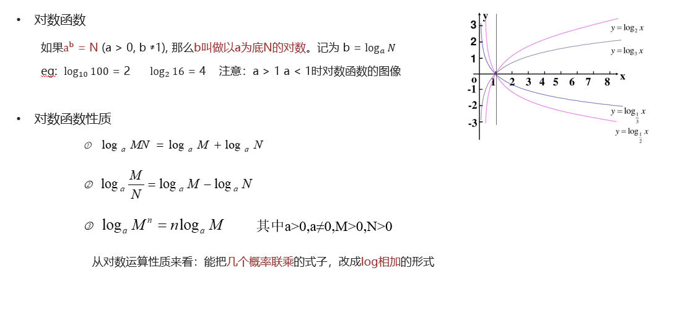
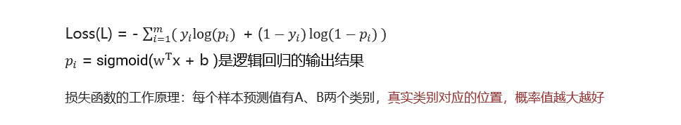
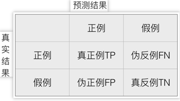

# 概念

逻辑回归是解决二分类问题的利器

## sigmoid函数

sigmoid函数将线性回归的输出转换为概率值，使逻辑回归可以解决二分类问题。

sigmoid函数将任意实数（线性回归结果）压缩到（0, 1）区间，让其转换为概率值。

函数定义：


## 概率

概率：事件发生的可能性。

联合概率：两个或者多个随机变量同时发生的概率。

条件概率：表示事件A在另外一个事件B已经发生条件下的发生概率

## 极大似然估计

根据观测结果来估计模型算法中的未知参数


## 对数函数



## 逻辑回归原理

一种分类模型，把线性回归的输出，作为逻辑回归的输入，输出是(0, 1)之间的值。

基本思想：

1. 利用线性模型 f(x) = wx + b，根据特征的重要性计算出一个值（预测值）
2. 在使用 sigmoid 函数将fx的输出映射为概率值
   1. 设置阈值（eg: 0.5），输出概率值大于0.5，则将未知样本输出为1类
   2. 否则输出为0类

逻辑回归的假设函数：

h(w) = sigmiod(wx + b)


逻辑回归损失函数：



# API使用

```
import pandas as pd
import numpy as np
from sklearn.linear_model import LogisticRegression
from sklearn.metrics import accuracy_score
from sklearn.model_selection import train_test_split
from sklearn.preprocessing import StandardScaler


# 1. 获取数据
data = pd.read_csv("data/breast-cancer-wisconsin.csv")
data.info()

# 2. 数据预处理
data = data.replace("?", np.NAN).dropna()
data.info() # 699 -> 683， 删除看异常值。

# 3. 确定特征和标签
x = data.iloc[:, 1:-1]
y = data.iloc[:, -1]
print(f""""
x.head(): {x.head()}
y.head(): {y.head()}
""")

# 4. 分割数据
x_train, x_test, y_train, y_test = train_test_split(x, y, test_size=0.2, random_state=22)

# 5. 特征处理
transfer = StandardScaler()
x_train = transfer.fit_transform(x_train)
x_test = transfer.transform(x_test)

# 6. 模型训练。
estimator = LogisticRegression()
estimator.fit(x_train, y_train)

# 7. 模型预测
y_predict = estimator.predict(x_test)
print(f"预测值：{y_predict}")

# 8. 模型评估
print(f'准确率: {accuracy_score(y_test, y_predict)}')
```

# 分类评估方法

## 混淆矩阵



正例：我们关注的的类别（比如如患病、欺诈、点击），数学表示 y = 1

假例：我们不关注的类别（比如健康、正常、未点击），数学表示 y = 0


混淆矩阵有4个指标：

1. 真实值是 正例，预测也是 正例；这部分叫做 真正例（TP, ture positive）
2. 真实值是 正例，预测为  假例；这部分叫做 伪反例 （FN, false negative）
3. 真实值是 假例，预测为 正例；这部分叫做 伪正例 （FP, false positive）
4. 真实值是 假例，预测也是 假例；这部分叫做 真反例 （TN, true negative）

## Precision（精确率）

精确率也叫查准率，指的是对正例样本的预测准确率：

精确率 = 真正例 / (真正例 + 伪正例 )


## Recall（召回率）

召回率也叫做查全率，指的是 预测为 真正例样本 占 真实正例样本的比重。

召回率 =  真正例 / (真正例 + 伪反例)


## F1-score


F1-score = 2 * 精确率 * 召回率 / (精确率 + 召回率)


## ROC曲线 和 AUC 值

ROC 曲线：我们分别考虑正负样本的情况：

1. 正样本中被预测为正样本的概率
2. 负样本中被预测为正样本的概率


AUC值：

1. AUC 是 ROC 曲线下面的面积，该值越大，则模型的辨别能力就越强
2. AUC  范围在 [0, 1] 之间
3. 当 AUC= 1 时，该模型被认为是完美的分类器，但是几乎不存在完美分类器

AUC 值主要评估模型对正例样本、负例样本的辨别能力.


## 分类评估报告api

```
sklearn.metrics.classification_report(y_true, y_pred, labels=[], target_names=None )
  '''
  y_true：真实目标值
  y_pred：估计器预测目标值
  labels:指定类别对应的数字
  target_names：目标类别名称
  return：每个类别精确率与召回率
  '''
输出结果
评估报告：
                 precision    recall  f1-score   support

          流失       0.80      0.90      0.84      1531
          留存       0.60      0.41      0.49       582

    accuracy                           0.76      2113
   macro avg       0.70      0.65      0.67      2113
weighted avg       0.74      0.76      0.75      2113
  
  
  
 from sklearn.metrics import roc_auc_score
  sklearn.metrics.roc_auc_score(y_true, y_score)
    计算ROC曲线面积，即AUC值
    y_true：每个样本的真实类别，必须为0(反例),1(正例)标记
    y_score：预测得分，可以是正例的估计概率、置信值或者分类器方法的返回值 
  
```


# 代码实例

```
import numpy as np
import pandas as pd
import seaborn as sns
import matplotlib.pyplot as plt
from sklearn.model_selection import train_test_split
from sklearn.linear_model import LogisticRegression
from sklearn.metrics import accuracy_score, classification_report, roc_auc_score

# 1.  加载数据
data = pd.read_csv("data/churn.csv")
data.info

# 2. 数据编码处理。
# 将分类变量转换为二进制（0/1）的虚拟变量，每个类别变成一个新的列。默认会处理 object类型（文本列、分类列）
churn_pd = pd.get_dummies(data)
print(churn_pd.head(5))

# 3. 删除多余的列。保留了Churn_Yes：留存为1，流失为0
# 保留了gender_Female，男：0, 女：1
churn_pd.drop(["Churn_No", "gender_Male"], axis=1, inplace=True)
print(churn_pd.head(5))

# 4. 列充命名
churn_pd.rename(columns = {"Churn_Yes": "flag", "gender_Female": "sex"}, inplace=True)
print(churn_pd.head(5))

# 5. 查看标签分布情况
print(churn_pd["flag"].value_counts())

# 6. 特征处理，拆分训练、测试集
x = churn_pd[['Contract_Month', 'internet_other', 'PaymentElectronic']]
y = churn_pd['flag']
x_train, x_test, y_train, y_test = train_test_split(x, y, random_state=22, test_size=0.3)

# 7. 模型训练
estimator = LogisticRegression()
estimator.fit(x_train, y_train)
# 正例的确定完全取决于中类别的出现顺序， 训练后确定
print(f"类别顺序: {estimator.classes_}")

# 8. 模型预测。
y_predict = estimator.predict(x_test)
print(f'预测结果: {y_predict}')

# 9. 模型评估
target_names = ["流失", "留存"]
print(f"""
准确率: {estimator.score(x_test, y_test)}
评估报告：{classification_report(y_test, y_predict, target_names=target_names)}
AUC值: {roc_auc_score(y_test, y_predict)}
""")
```